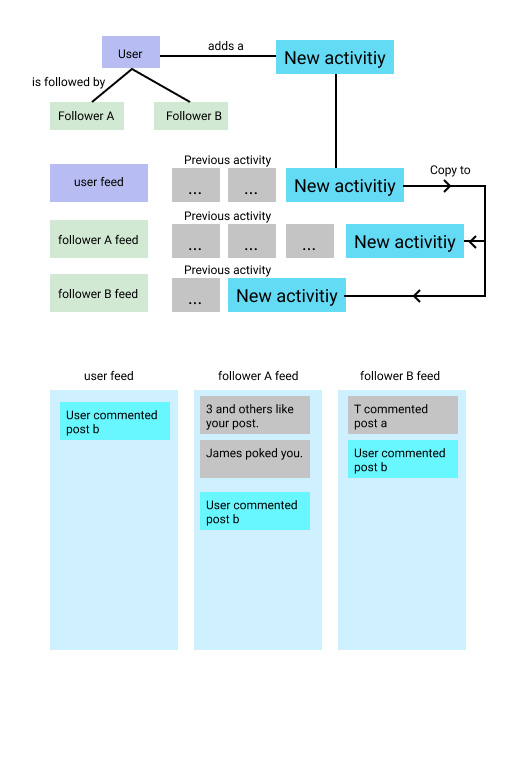

# Notice
Currently, this library is in the process of porting and developing. This public repository is to seek help to port from [Stream Framework](https://github.com/tschellenbach/Stream-Framework).


# Features: 
- Activity Feed, eg: facebook feeds
- Notification


# Help wanted
Yes, I am shorts of hands and also 'brain-power'. If you wish to help, PR is most welcome.

# Usage
```
  import { Manager, setupRedisConfig } from 'superstream'
  import faker from 'faker'

  class CustomManager extends Manager {

      // get your User FollowerIds
      // to copy activities to your user's follower
      async getUserFollowerIds(userId) {
          const followerIds = await this.myDatabase.getFollowers(userId)
          return {
            [FanoutPriority.HIGH] : followerIds
          }
      }
  }

  (()=>{
      setupRedisConfig({
        host: 'localhost',
        port: 6379
      })

      const customManager = new CustomManager()

      // user creates an activity
      const newActivity = new Activity({
        actor: `user:${faker.datatype.uuid()}`,
        verb: faker.random.arrayElement([`cinema:book`, 'themepark:go']),
        object: `movie:${faker.datatype.number()}`,
        target: 'cinema:gold_bridge_cinema',
        extraContext: {
          price: 12
        }
      })

      // add to user feed
      await feed.addUserActivity(userId, activity1)

      // get current user feed
      const userFeed = feed.getUserFeed(userId)
      const activities = await userFeed.getItem(0, 5)
  })
```
 
# How it works  


# What is has changed from the source?
- Field ID:

    Stream Framework only support integer ID by default to redis and cassandra.

    This port supports ID with string, such as `User:123` instead of just `123` by default.

- serializationId generator: 

    Each activity is assigned an Unique ID, 

    Previously, from stream-framework:
    ```
      activity.serialization_id = 1373266755000000000042008
      1373266755000 activity creation time as epoch with millisecond resolution
      0000000000042 activity left padded object_id (10 digits)
      008 left padded activity verb id (3 digits)
    ```
    Currently
    The format is about the same but our id field are not string instead of Int we have to hash it.
    Hence, our collision fate is now base on the hashing function.
    What this does is objectId and verbId are both in string hence we have to hash it to generate an integer
    ```
      // remove all the unhashable key such as :;,
      // convert any string to int any number and truncate the number to fixed size
      // using object id and verb
      // which can be generated repeatedly under any machine
      const milliseconds = (Number(datetimeToEpoch(this.time) * 1000))
      const objectIdPad = hashCodePositive(this.objectId + this.verbId)
        .toString()
        .padStart(10, '0')
      const serializationId = `${milliseconds}${objectIdPad}` // % (milliseconds, this.objectId, this.verb.id)
    ```


# How can you help 
Please see this issue: https://github.com/imcyee/superstream/issues/1

# Road map
- [X] Support any type of id (now only support integer, and kinda problematic for string id)
- [X] sorted set support of integer rank
- [ ] Port aggregate
  - [X] Direct translate
  - [] Test
  - [X] redis
  - [ ] cassandra
- [ ] Port manager


# Key concept
## Activity 
an entity that enclose information, actors, context, objects, etc
Best practice - Saves only IDs instead of the whole object to activity and then `re-hydrate` it with your own data. So, if you edit your object, you don't have to edit it in feed.

## Feed
A feed stores a collection of activities. 
Each user can have a few feeds, such as notification feed that store all the notification feed. 


## Serializer
Preparing data to be persisted/loaded, Each type of persistence will require a different serializer.
It jobs determine how data is getting translate between api layer and persistence layer.
 

## Storage
Currently supported storages are 
- redis
- cassandra (Partially)
 
### Which persistence storage to use
Redis: https://redis.io/topics/persistence

(Not fully supported yet)
Cassandra: https://stackoverflow.com/questions/18462530/why-dont-you-start-off-with-a-single-small-cassandra-server-as-you-usually

### Get started - storage
#### Redis - setup redis config
#### Cassandra - Run migration first
 
# What To Store
 
Stream allows you to store custom data in your activities. How much data you store in the activities is up to you. Here are a few recommendations:

Always send the foreign_id and time fields. Without "foreign_id" and "time," you won't be able to update activities.

Keep data normalized when possible to avoid complex update flows. Activity fields like actor and object often contain complex objects like users, posts, or articles. Since the data for those objects can be updated, it is better to store a reference (e.g. their ID or URI) and replace them with the full object at read-time.

Store a user id and not the full user object. Otherwise, if someone changes their user image or username, you'll have to update tons of activities.

Attach metadata like tags and categories (if applicable) to your activities. This will help our data-science team optimize your feed personalization algorithms. (available on enterprise plans).

If you're using ranked feeds we recommend storing counts of the likes and comments. That allows you to take those factors into account when sorting feeds.

Activities have a max size. Storing a large amount of text is ok, storing images directly in the activity won't work, you should store the image URL instead.


# Why timeline are saving to activity and timeline
Each activity can be save in different feed, your custom feed, timeline feed, notification feed and etc. Saving a seperate activity can share among all feeds. Think of it as RMDBS normalization, like how we use join, instead of populating every row, which is fast but also waste spaces.


# Running test 
We are using testContainer which run with docker.
If test failed: 
You may have to: 
- Pull neccessary image to run test. Run `npm run test:watch`

# Credit
Stream-Framework [https://github.com/tschellenbach/Stream-Framework] 


# Follow user/unfollow user
We will copy every activity that has actorId or targetId of the user being followed.
Same goes for unfollow, all activities with actorId or targetId will be removed from current user feed. 
Please note that: you have to specify `separator` for config.
Because when we are copying data, it will compare userId with the actorId you supplied.
Eg: 'user:123', 'user:customer:123' or '123'
Hence you have to specify the separator for superstream to know how the get the id
Below is example for `user:123`

```
import {setConfig} from 'superstream'

setConfig({
  separator: ":"
})

```


# Refillment Guide
All activities queried are id only, hence it is required to rehydrate your activity before sending to client.
Guide can be founded [here](./doc/refillment).